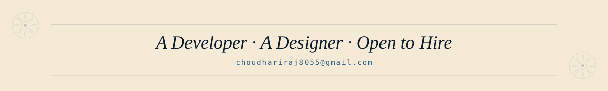

<!-- ============================================================ -->
<!--   THE RAAJ ALMANAC · VOL. I · NO. 01                         -->
<!--   Section-by-section hybrid: SVG art + live markdown links   -->
<!-- ============================================================ -->

<!-- 1 · MASTHEAD -->

  

<!-- 2 · CATALOGUED NOTICE -->

  

<!-- 3 · SALUTATION + FIELD NOTICE -->

  

<!-- 4 · HERBARIUM OF TOOLS -->

<!-- live shields beneath the herbarium -->

  
  
  
  
  
  
  

 

<!-- 5 · CURRENT SEASON -->

  

<!-- ❦ ALMANAC OF FIGURES — live widgets themed to palette -->
<h2><i>❦ &nbsp; An Almanac of Figures</i></h2>
STATISTICS · OBSERVED · TABULATED · PRESSED IN TWO COLOURS

  

&nbsp;

  

  

<!-- 6 · CORRESPONDENCE -->

<!-- live link row beneath the stamps -->

  <a href="mailto:placeholder@example.com">Email</a> &nbsp;·&nbsp;
  <a href="https://linkedin.com/in/placeholder">LinkedIn</a> &nbsp;·&nbsp;
  <a href="https://twitter.com/placeholder">Twitter / X</a> &nbsp;·&nbsp;
  <a href="https://example.com">Portfolio</a> &nbsp;·&nbsp;
  <a href="https://mastodon.social/@placeholder">Mastodon</a>

 

<!-- 7 · COLOPHON -->

<em>This README is a living specimen. Last pressed: see commit history.</em>

