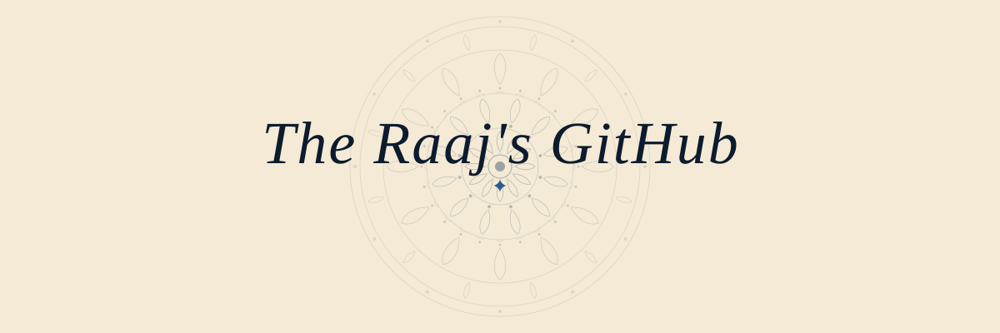
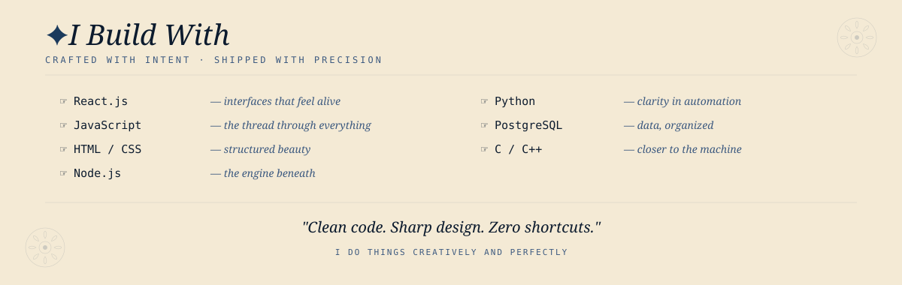
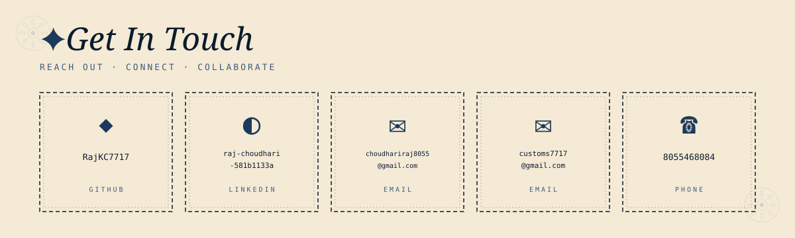

<!-- ═══════════════════════════════════════════════════════ -->
<!--   THE RAAJ'S GITHUB · Profile README                   -->
<!--   Navy & Cream palette · Mandala art                    -->
<!-- ═══════════════════════════════════════════════════════ -->

<!-- 1 · TITLE -->

  

<!-- 2 · TAGLINE -->

  

<!-- 3 · SKILLS -->

<!-- tech badges -->

  
  
  
  
  
  
  

 

<!-- GitHub Stats -->

&nbsp;

  

<!-- CONTACT -->

<!-- live links -->

  <a href="https://github.com/RajKC7717">GitHub</a> &nbsp;·&nbsp;
  <a href="https://linkedin.com/in/raj-choudhari-581b1133a">LinkedIn</a> &nbsp;·&nbsp;
  <a href="mailto:choudhariraj8055@gmail.com">Email</a> &nbsp;·&nbsp;
  <a href="mailto:customs7717@gmail.com">Alt Email</a>

<em>This README is a living document. Last updated: see commit history.</em>

